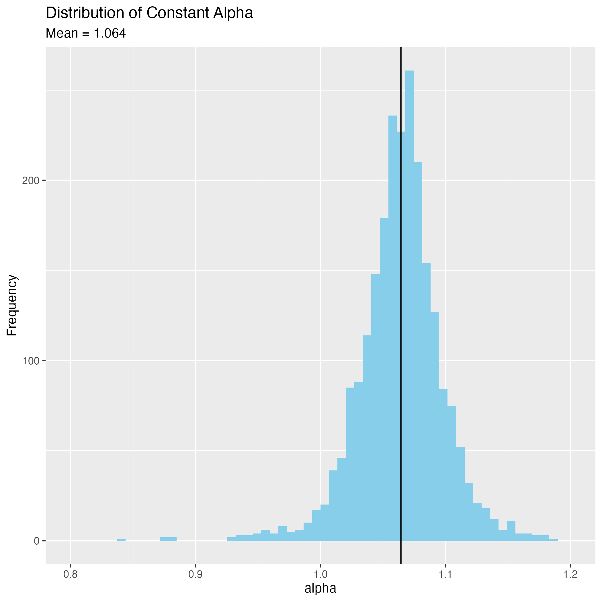

# Predicting Performance in Indoor Rowing

Rowers train indoors on the [Concept 2] ergonometer, which measures the
time to row a given distance. These numbers are generally used to assess
fitness. 

Frequently the question comes up, given an existing performance like
3:20min over 1000m, what performance can an athlete expect for another
distance like 2000m or 5000m?

## Paul's Law

Paul's Law, a folklore whose origin in rowing is not clear, provides a
rule of thumb: 

> When the total distance doubles, the time over 500m increases by 5
> seconds.

In rowing the time over 500m is called the _split_ and is the most
common way to refer to speed. Given 3:20min over 1000m implies 1:40 over
500m. For 2000m the expected time would be $1:45 \times 4 = 7:00$
minutes.

Paul's Law expressed as a formular when $t_0$ over distance $d_0$ is
known and we are looking for the predicted time $t_1$ over distance
$d_1$:

$$
t_1 = d_1 \left( \frac{t_0}{d_0} + 
     \frac{1}{100}\mathrm{log}_2 \frac{d_1}{d_0}\right)
$$

<strong>
But how accurate is this "law"? This repository contains a dataset and
tries to provide an answer.
</strong>

## The C2 Logbook

[Concept 2] maintains an online ranking for performance on the
ergonometer, the [Logbook]. Rowers can create an account and upload
training data. When this is done using [Concept 2]'s _ErgData_ app, the
result is marked as verified since it takes the data directly from the
rowing machine.

    ==> pairs.csv <==
    year,gender,name,age,dist1,time1,dist2,time2
    2025,f,CA3C50104C50E18DF97B5FDB6DD61A51,41,1000,194,5000,1074.3
    2025,f,30E7F8121E7BB974935271278BDE71CB,38,1000,195,2000,419.9
    2025,f,30E7F8121E7BB974935271278BDE71CB,38,1000,195,5000,1126.9
    2025,f,5B641684246CBD871E90A6BF1CDD8DE2,30,1000,196.6,2000,426.9
    2025,f,6FB4C1A2D71A158778AD2EDB85E0EE32,40,1000,197.6,2000,417.8
    2025,f,6FB4C1A2D71A158778AD2EDB85E0EE32,40,1000,197.6,5000,1109.7
    2025,f,CE825D590582EEFBD5C529E6A12E0250,32,1000,201.6,2000,424.1
    2025,f,CE825D590582EEFBD5C529E6A12E0250,32,1000,201.6,5000,1115
    2025,f,4AE5B7B3679C3ECD9C4F8E858788F458,39,1000,208,2000,433.2

File [pairs.csv](./pairs.csv) contains 2000+ data points from the 2025
ranking that only includes verified results.

* gender (male, female)
* MD5 hash of the athlete's name
* age
* distance 1 in meters and time 1 in seconds
* distance 2 in meters and time 2 in seconds

So each line captures two performances _of the same athlete_ over two
distances. The same athlete may have more entries in this filer:

    2025,m,22D90C393F79EC2180C6427A5F6FA0BE,45,1000,179.7,2000,391.8
    2025,m,22D90C393F79EC2180C6427A5F6FA0BE,45,1000,179.7,5000,1047
    2025,m,22D90C393F79EC2180C6427A5F6FA0BE,45,2000,391.8,5000,1047

## The Paul Constant

We compute in [pauls-law.r](./pauls-law.r) for each line the time
change in split time per double the distance that predicts the second
performance from the first. If Paul's Law is accurate, we expect this
constant to be around 5s. 

Below is the distribution of the Paul Constant as we found it:

       Min. 1st Qu.  Median    Mean 3rd Qu.    Max. 
    -18.700   3.683   5.012   5.026   6.317  40.725 

Paul's Law appears to be quite accurate on average: An increase of 5.0
seconds per 500m per double the distance predicts the seconds
performance based on the first. At the same time, the distribution
reveals data that suggest not both efforts were maximal: 

* A constant close to zero suggests the same split over both distances
* A negative constant indicates a faster performance over the longer
  distance.

We could recalculate the distribution by defining some criterion that
eliminates questionable efforts.

## Power Law

An alternative way to predict performace in endurace sports is using a
power law described in

> Drake, J.P., Finke, A. & Ferguson, _R.A. Modelling human endurance:
> power laws vs critical power_. Eur J Appl Physiol 124, 507–526 (2024).
> [https://doi.org/10.1007/s00421-023-05274-5]([https://doi.org/10.1007/s00421-023-05274-5])

The power law describes an expected finishing time $t_1$ for distance
$d_1$ based on an earlier performance of $t_0$ over distance $d_0$:

$$
t_1 = t_0 \times (d_1/d_0)^\alpha
$$

with $\alpha \approx 1.064$.

       Min. 1st Qu.  Median    Mean 3rd Qu.    Max. 
     0.7971  1.0462  1.0645  1.0641  1.0827  1.5240 

Below is the distribution of $\alpha$ for the same (slightly flawed)
dataset.

If we use $\alpha=1.64$, what does this mean for our initial example of
1000m in 3:20min? 

$$
3:20 \times 2^{1.064} = 06:58.14
$$

It would predict a 2000m time of 06:58.14, slighty
faster than the prediction by Paul's Law of 7:00.

[Concept 2]: https://www.concept2.com
[Logbook]: https://log.concept2.com/rankings

